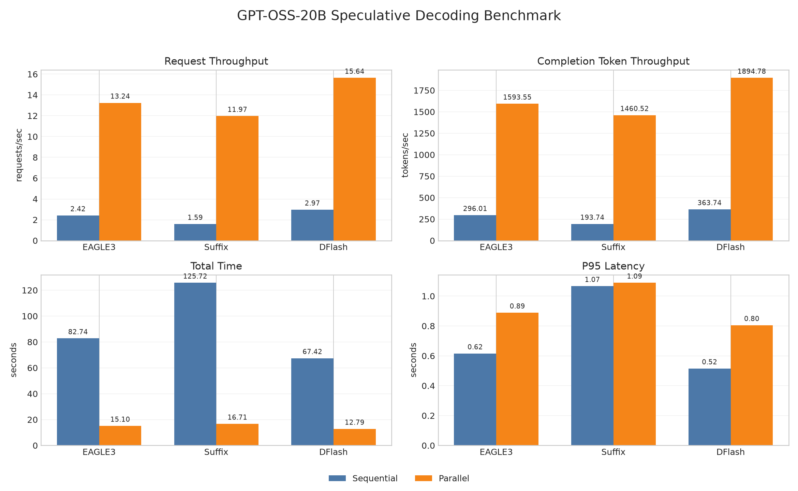

# GPT-OSS-20B Speculative Decoding Benchmark

Inference-time benchmark for GPT-OSS-20B with EAGLE3, Arctic suffix decoding,
and DFlash. (benchmark-feb26 branch has comparison between Draft and EAGLE3)

## Dataset

BFCL v3 prompts from `gorilla-llm/Berkeley-Function-Calling-Leaderboard`:

- `BFCL_v3_simple.json`
- `BFCL_v3_multiple.json`
- `BFCL_v3_parallel.json`
- `BFCL_v3_parallel_multiple.json`

The first 200 rows are formatted as agent JSON tool-call generation requests.

## Code Layout

- `inference_*.py` downloads the base and draft models, starts vLLM
  with speculative config, runs both benchmark phases, and saves the results.
- `benchmark.py` loads BFCL prompts, sends OpenAI-compatible chat completion
  requests, and calculates latency/throughput metrics.

## Runs

Each method uses 8 warmup requests before measurement.

- Sequential: 200 requests, `--max-num-seqs 1`
- Parallel: 200 requests, concurrency 8, `--max-num-seqs 8`

Model/config used for this run:

- EAGLE3: `RedHatAI/gpt-oss-20b-speculator.eagle3`,
  `num_speculative_tokens=6`
- Suffix decoding: `num_speculative_tokens=24`,
  `suffix_decoding_max_tree_depth=24`,
  `suffix_decoding_max_spec_factor=1.0`,
  `suffix_decoding_min_token_prob=0.1`
- DFlash: `z-lab/gpt-oss-20b-DFlash`, `num_speculative_tokens=8`,
  `attention_backend=FLASH_ATTN`

Before the full run, a quick 48-request parallel sweep was run over EAGLE3 and
DFlash speculative decoding configs:

| Config | Req/s | Completion tok/s | Mean latency | P95 latency |
|---|---:|---:|---:|---:|
| EAGLE3, 2 tokens | 10.11 | 1083.90 | 0.737s | 1.563s |
| EAGLE3, 4 tokens | 11.64 | 1284.93 | 0.648s | 1.236s |
| EAGLE3, 6 tokens | 12.79 | 1404.48 | 0.579s | 0.874s |
| DFlash, 4 tokens | 10.69 | 1155.92 | 0.685s | 1.487s |
| DFlash, 8 tokens | 14.47 | 1580.46 | 0.506s | 0.833s |

A second 48-request parallel sweep was run for suffix decoding:

| Config | Req/s | Completion tok/s | Mean latency | P95 latency |
|---|---:|---:|---:|---:|
| 8 tokens, min prob 0.05, factor 1.0 | 12.84 | 1374.95 | 0.579s | 1.037s |
| 12 tokens, min prob 0.05, factor 1.0 | 12.36 | 1363.65 | 0.581s | 0.959s |
| 16 tokens, min prob 0.10, factor 1.0 | 12.07 | 1352.43 | 0.577s | 1.000s |
| 16 tokens, min prob 0.05, factor 1.5 | 12.60 | 1395.16 | 0.559s | 1.032s |
| 24 tokens, min prob 0.10, factor 1.0 | 12.86 | 1415.51 | 0.557s | 0.972s |

## Results

| Method | Phase | Total time | Req/s | Completion tok/s | Mean latency | P95 latency |
|---|---|---:|---:|---:|---:|---:|
| EAGLE3 | Sequential | 82.74s | 2.42 | 296.01 | 0.414s | 0.616s |
| EAGLE3 | Parallel | 15.10s | 13.24 | 1593.55 | 0.590s | 0.889s |
| Suffix decoding | Sequential | 125.72s | 1.59 | 193.74 | 0.629s | 1.066s |
| Suffix decoding | Parallel | 16.71s | 11.97 | 1460.52 | 0.659s | 1.089s |
| DFlash | Sequential | 67.42s | 2.97 | 363.74 | 0.337s | 0.515s |
| DFlash | Parallel | 12.79s | 15.64 | 1894.78 | 0.502s | 0.805s |



## Backends

Backend selection from the saved vLLM startup logs:

| Method | Target attention | Target MoE | Draft attention |
|---|---|---|---|
| EAGLE3 | `TRITON_ATTN` | `MARLIN` Mxfp4 | `FLASH_ATTN` / FlashAttention v2 |
| Suffix decoding | `TRITON_ATTN` | `MARLIN` Mxfp4 | none |
| DFlash | `TRITON_ATTN` | `MARLIN` Mxfp4 | `FLASH_ATTN` / FlashAttention v2 |

The target GPT-OSS-20B model used `MoEPrepareAndFinalizeNoDPEPModular` for MoE
prepare/finalize. FlashInfer top-p/top-k sampling was disabled for all runs, so
sampling used the PyTorch-native sampler.

## Commands

Run one method:

```bash
cd spec-decoding-bench
python3 inference_eagle3.py
python3 inference_suffix_decoding.py
python3 inference_dflash.py
```

Run all methods:

```bash
cd spec-decoding-bench
python3 run_all.py
```

Run the quick speculative config sweep:

```bash
cd spec-decoding-bench
python3 sweep_spec_config.py
python3 sweep_suffix_decoding.py
```

Create the summary graph:

```bash
cd spec-decoding-bench
python3 plot_results.py
```

## Notes

`VLLM_USE_FLASHINFER_SAMPLER=0` is set inside the vLLM subprocess because this
image has `curand.h` under the Python NVIDIA package path instead of
`/usr/local/cuda/include`, which breaks FlashInfer sampler JIT.

DFlash uses `--disable-hybrid-kv-cache-manager` so its draft attention layers
stay in a compatible KV cache group on GPT-OSS's hybrid sliding/full attention
layout.

Also, GPT-OSS doesn't support flashinfer attention backend due to sink attention.
